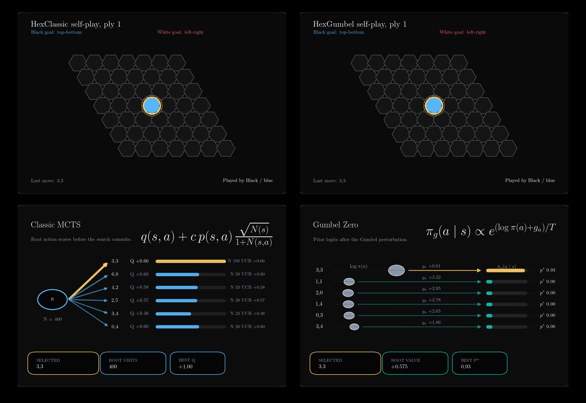

# Monte Carlo Tree Search for Hex and Y



This repository contains a unified study of search-based agents for connection
games of Hex and Y variation. It currently covers three modules:

| Module | Game | Method |
|---|---|---|
| `HexClassic/` | Hex | UCT + RAVE + bridge rollouts |
| `HexGumbel/` | Hex | Gumbel AlphaZero with supervised warm start |
| `YClassic/` | Y | UCT + RAVE + connectivity rollouts |


The codebase is organized so that the classical and learned agents can be
compared inside one engineering framework rather than as unrelated projects.
The detailed write-up lives in [report/report.tex](report/report.tex).


---

## 1. `HexClassic/`

`HexClassic/` is a comparative implementation of the algorithm from
*Monte-Carlo Hex* by Cazenave and Saffidine. The core search is classical UCT
plus RAVE (AMAF), with type-2 rollouts that only enforce bridge defense. This
deliberately removes the paper's stronger level-2 templates so the behavior of
the search algorithm itself is easier to inspect.

### Main Results

All results below use the Cython backend on `11x11`, `200` games per data
point.

#### Simulation Count

| Simulations | Ours (type 2) | Paper (type 3) | Delta |
|:-----------:|:-------------:|:--------------:|:-----:|
| 1,000       | 31.5%         | 6.0%           | +25.5 |
| 2,000       | 45.5%         | 11.5%          | +34.0 |
| 4,000       | 41.5%         | 20.0%          | +21.5 |
| 8,000       | 50.0%         | 33.0%          | +17.0 |
| 32,000      | 55.5%         | 61.0%          | -5.5  |
| 64,000      | 66.5%         | 68.5%          | -2.0  |

Trend: increasing the simulation budget still increases strength, and the
curve converges toward the paper once the tree policy matters more than rollout
quality.

#### UCT Exploration Constant

| `C_uct` | Ours (type 2) | Paper (type 3) | Delta |
|:-------:|:-------------:|:--------------:|:-----:|
| 0.0     | 88.0%         | 61.0%          | +27.0 |
| 0.1     | 62.5%         | 60.0%          | +2.5  |
| 0.2     | 52.5%         | 55.5%          | -3.0  |
| 0.4     | 43.0%         | 42.0%          | +1.0  |
| 0.5     | 55.5%         | 41.0%          | +14.5 |
| 0.6     | 47.5%         | 35.5%          | +12.0 |
| 0.7     | 50.5%         | 32.5%          | +18.0 |

Takeaway: with RAVE active, `C_uct = 0.0` is best. RAVE already supplies the
exploration pressure, so extra UCT exploration mostly hurts.

#### Rollout Policy

| Matchup | Ours | Paper |
|:--|:--:|:--:|
| Type 1 (random) vs type 2 (bridges) | 28.5% | 22.0%* |

`*` The paper reports type 1 vs type 3 rather than type 1 vs type 2.

Takeaway: even lightweight local structure matters. Random playouts are much
weaker than bridge-aware ones.

#### RAVE Bias

| RAVE bias | Ours (type 2) | Paper (type 3) | Delta |
|:---------:|:-------------:|:--------------:|:-----:|
| 0.0005    | 47.0%         | 50.5%          | -3.5  |
| 0.00025   | 49.0%         | 59.0%          | -10.0 |
| 0.000125  | 46.0%         | 53.5%          | -7.5  |

Takeaway: the HexClassic implementation preserves the qualitative behavior of
UCT + RAVE, but type-2 rollouts make AMAF tuning flatter than in the stronger
type-3 setting from the paper.

### Usage

```bash
cd HexClassic/

python setup.py build_ext --inplace
python experiments.py sanity --cython
python experiments.py small --cython --seed 42
python experiments.py all --cython --seed 42
python play_hex.py --size 7 --sims 3000
```

---

## 2. `HexGumbel/`

`HexGumbel/` replaces rollouts with a neural policy-value model and uses the
Gumbel AlphaZero root policy. The project uses supervised pretraining from the
classical Hex agent before switching to self-play, because the available
compute budget was too small for a clean cold start.

### Training Pipeline

1. Generate expert labels with `HexClassic`.
2. Pretrain the policy head on those labels.
3. Run self-play reinforcement learning with Gumbel search at the root and
   PUCT below the root.

The setup uses a `7x7` board and a much smaller simulation budget than the
classical baseline.

### Main Result

The trained agent is evaluated against classical Hex MCTS using `16,000`
simulations per move, while the neural agent uses only `16`.

| Iteration | vs Random | vs MCTS 16K | Buffer Size |
|:---------:|:---------:|:-----------:|:-----------:|
| 5         | 100%      | 10.0%       | 69,220      |
| 10        | 100%      | 32.5%       | 132,931     |
| 20        | 100%      | 45.0%       | 255,492     |
| 30        | 100%      | 55.0%       | 121,818     |
| 40        | 100%      | 62.5%       | 63,061      |
| 50        | 100%      | 55.0%       | 61,491      |
| 60        | 100%      | 50.0%       | 62,208      |
| 70        | 100%      | 70.0%       | 188,366     |

Takeaway: on the chosen `7x7` setting, the trained Gumbel agent reaches
roughly `65-70%` against a classical opponent using a thousand times more
simulations.

### Usage

```bash
cd HexGumbel/

python setup.py build_ext --inplace
python pretrain_supervised.py --data data/expert_data_16k.jsonl
python train.py --resume checkpoints/pretrained_model_16k.pt
python eval_checkpoint.py --checkpoint checkpoints/<run_id>/iter_0070.pt
```

---

## 3. `YClassic/`

`YClassic/` extends the classical branch to the game of Y. The implementation
uses the regular triangular hex-grid version of Y rather than the commercial
Kadon board with three five-neighbor points. This is still a standard Y model,
and it is the simplest geometry for a direct comparison with Hex.

### Rule Model

- A player wins by forming one connected group touching all three sides.
- Corner cells count as belonging to both adjacent sides.
- On a full board there is exactly one winner.

Those conditions were checked against standard Y descriptions such as
Boardspace and Gambiter before locking down the board logic.

### What Changed Relative to Hex

- Hex connects two sides; Y connects three, so each connected component carries
  a 3-bit side mask instead of using two virtual borders.
- Y has no direct analogue of Hex bridges, so the rollout policy uses local
  connectivity features rather than hard-coded bridge saves.
- The implementation is still split into Python and Cython backends with the
  same API as `HexClassic`.

### Verification

- Board logic is covered by automated tests against a naive connectivity
  checker on random games and exhaustive small full boards.
- The Cython board is checked against the Python board for state-by-state
  agreement.
- `python -m unittest discover -s YClassic -p 'test_*.py'` passes in the
  existing `hex` environment.
- `experiments_y.py sanity --cython` gave `20/20` wins against random.

### Speed

Direct empty-board benchmark, side length `7`, `2000` simulations, same move
selection task:

| Backend | Time |
|---|---:|
| Python | `0.298s` |
| Cython | `0.0135s` |
| Speedup | `22.1x` |

At the larger `11`-side setting with the Cython backend and the same
`2000`-simulation root search, Hex took `0.0276s` and Y took `0.0377s`, so Y
is only about `1.37x` more expensive than Hex in the matched benchmark.

### Main Results

All results below come from the saved full run
`python3 experiments_y.py all --cython --seed 42 --workers 20`. The script
writes one JSON file per table plus `all_results.jsonl` in `YClassic/results/`.

#### Simulation Scaling

Side length `11`, `200` games per point, win rate against a `16000`-simulation
reference.

| Matchup | Win rate vs 16000-sim reference |
|---|---:|
| 1000 vs 16000 sims | 2.5% |
| 2000 vs 16000 sims | 17.0% |
| 4000 vs 16000 sims | 34.0% |
| 8000 vs 16000 sims | 44.5% |
| 32000 vs 16000 sims | 55.0% |
| 64000 vs 16000 sims | 60.5% |

Takeaway: Y shows the expected monotone improvement with more simulations and
crosses the `50%` mark once it exceeds the `16000`-simulation reference.

#### UCT Exploration Constant

All rows use `16000` simulations and compare against a `C_uct = 0.3`
reference.

| `C_uct` | Win rate vs `C_uct = 0.3` |
|---|---:|
| `0.0` | 90.0% |
| `0.1` | 76.0% |
| `0.2` | 59.0% |
| `0.4` | 45.5% |
| `0.5` | 43.5% |
| `0.6` | 45.5% |
| `0.7` | 47.5% |

Takeaway: with RAVE enabled, Y strongly prefers `C_uct = 0.0`, even more
decisively than the comparable Hex sweep.

#### Rollout Policy and RAVE Bias

| Experiment | Result |
|---|---:|
| Random rollout vs connectivity rollout | 37.5% |
| `bias = 0.0005` vs `0.001` | 51.5% |
| `bias = 0.00025` vs `0.001` | 50.0% |
| `bias = 0.000125` vs `0.001` | 47.5% |

Takeaway: the connectivity rollout is clearly stronger than random, while
RAVE bias is comparatively flat around `0.00025-0.0005`. The Y stack is no
longer a toy calibration; at `11` side length it already reproduces the same
kind of nontrivial search trends seen in `HexClassic`.

### Usage

```bash
cd YClassic/

python3 setup.py build_ext --inplace
python3 experiments_y.py sanity --cython
python3 experiments_y.py all --cython --seed 42 --workers 20
python3 play_y.py --cython --size 7 --sims 3000
```

Experiment outputs are saved automatically under `YClassic/results/`.

---

## Repository Layout

```text
HexClassic/    Classical Hex MCTS with Python and Cython backends
HexGumbel/     Neural Hex MCTS with supervised warm start and self-play
YClassic/      Classical Y MCTS with Python and Cython backends
report/        Unified write-up for the whole project
visualization/ Dashboard GIF generation
```

---

## Setup

```bash
conda create -n hex python=3.11
conda activate hex
pip install torch numpy cython tqdm

cd HexClassic && python setup.py build_ext --inplace && cd ..
cd HexGumbel && python setup.py build_ext --inplace && cd ..
cd YClassic && python3 setup.py build_ext --inplace && cd ..
```

The existing `hex` environment is sufficient to build and run all three active
modules.

---

## Report

The consolidated project write-up is in
[report/report.tex](report/report.tex). It is the place where
the repository architecture, the Hex and Y rule models, the shared engineering
choices, and the three experimental branches are described together.

---

## References

- T. Cazenave and A. Saffidine, *Monte-Carlo Hex*.
- I. Danihelka et al., *Policy improvement by planning with Gumbel*.
- D. Silver et al., *Mastering the game of Go without human knowledge*.
