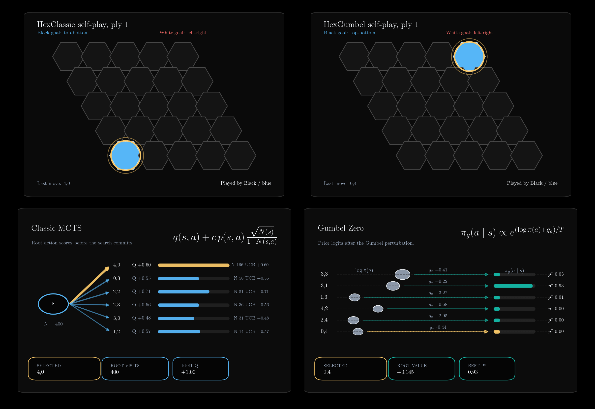

# MCTS for Hex

Exploring Monte Carlo Tree Search approaches for the game of Hex, from
classical UCT + RAVE to learned evaluation (AlphaZero). Each approach lives in
its own directory with shared benchmarking so they can be compared head-to-head.



## 1. Classical MCTS — `HexClassic/`

Comparative study of the algorithm from **"Monte-Carlo Hex"** (Cazenave &
Saffidine). We implement UCT + RAVE with **type 2 rollouts** (bridge defense
only) and measure how well the paper's results — originally obtained with
type 3 rollouts (bridges + level-2 edge templates) — hold under a simpler
rollout policy.

The point is to isolate the contribution of the core search algorithm from the
domain-specific knowledge baked into higher-level templates.

### Results

All experiments: 11x11 board, 200 games per data point, Cython backend.

#### Table 1 — Simulation count

*How does playing strength scale with more simulations?*

Each agent plays against a 16k-sim reference (UCT + RAVE, C=0.3, bias=0.00025,
type 2).

| Simulations | Ours (type 2) | Paper (type 3) | Delta |
|:-----------:|:-------------:|:--------------:|:-----:|
| 1,000       | 31.5%         | 6.0%           | +25.5 |
| 2,000       | 45.5%         | 11.5%          | +34.0 |
| 4,000       | 41.5%         | 20.0%          | +21.5 |
| 8,000       | 50.0%         | 33.0%          | +17.0 |
| 32,000      | 55.5%         | 61.0%          | −5.5  |
| 64,000      | 66.5%         | 68.5%          | −2.0  |

The trend is preserved: more simulations = stronger play. The spread is
compressed at low sim counts because our type 2 reference is weaker (easier to
beat). At 32k–64k the tree policy dominates rollout quality and our results
converge with the paper's (66.5% vs 68.5%).

#### Table 2 — UCT exploration constant

*What is the optimal exploration-exploitation trade-off?*

Each agent varies C_uct against a C=0.3 reference (16k sims, RAVE, type 2).

| C_uct | Ours (type 2) | Paper (type 3) | Delta |
|:-----:|:-------------:|:--------------:|:-----:|
| 0.0   | 88.0%         | 61.0%          | +27.0 |
| 0.1   | 62.5%         | 60.0%          | +2.5  |
| 0.2   | 52.5%         | 55.5%          | −3.0  |
| 0.4   | 43.0%         | 42.0%          | +1.0  |
| 0.5   | 55.5%         | 41.0%          | +14.5 |
| 0.6   | 47.5%         | 35.5%          | +12.0 |
| 0.7   | 50.5%         | 32.5%          | +18.0 |

Both agree: **C=0.0 is optimal when RAVE is active**. RAVE already handles
exploration, so UCT's bonus becomes redundant or harmful. The paper shows a
cleaner monotonic decline because its stronger type 3 reference punishes
suboptimal C values more harshly.

#### Table 3 — Rollout policy

*How much does bridge defense improve over random?*

Type 1 (random) vs type 2 (bridges), 16k sims, C=0.0, RAVE.

| Matchup                              | Ours   | Paper  |
|:-------------------------------------:|:------:|:------:|
| Type 1 (random) vs type 2 (bridges)  | 28.5%  | 22.0%* |

*\*Paper measures type 1 vs type 3 (bridges + templates), not vs type 2.*

Random wins only 28.5% against bridges — roughly equivalent to a 3:1
simulation disadvantage. The paper's 22% is even lower because their reference
(type 3) is tougher. This confirms the hierarchy: random << bridges <<
templates, and that even the simplest domain knowledge makes a real difference.

#### Table 4 — RAVE bias

*How sensitive is RAVE to the bias parameter?*

Each agent varies RAVE bias against bias=0.001 (16k sims, C=0.0, type 2).

| RAVE bias  | Ours (type 2) | Paper (type 3) | Delta |
|:----------:|:-------------:|:--------------:|:-----:|
| 0.0005     | 47.0%         | 50.5%          | −3.5  |
| 0.00025    | 49.0%         | 59.0%          | −10.0 |
| 0.000125   | 46.0%         | 53.5%          | −7.5  |

The paper finds a clear peak at bias=0.00025. Our results are flat (~47–49%).
This is the most interesting divergence: **RAVE tuning sensitivity depends on
rollout quality**. With type 3, AMAF statistics are more informative so
trusting them longer (lower bias) pays off. With type 2, the AMAF signal is
noisier, so the payoff from precise tuning disappears.

#### Summary

| Experiment | Paper finding | Preserved? | Notes |
|:----------:|:------------:|:----------:|:-----:|
| Sim count | More sims = stronger | Yes | Compressed at low sims, converges at high sims |
| C_uct | C=0.0 optimal with RAVE | Yes | Noisier at high C (weaker reference) |
| Rollout type | Better rollouts = stronger | Yes | 28.5% confirms bridges >> random |
| RAVE bias | Lower bias preferred | Partially | Flat — noisier AMAF reduces tuning payoff |

The core UCT + RAVE algorithm is robust: its qualitative behavior holds even
with a simpler rollout policy. Type 3 templates amplify differences and sharpen
parameter sensitivity, but aren't needed for the algorithm itself to work.

### Implementation

Two interchangeable backends:

| | Python | Cython |
|---|---|---|
| Files | `mcts_hex.py` + `hex_board.py` | `cmcts_hex.pyx` + `chex_board.pyx` |
| Speed (11x11, 500 sims) | ~3.9s/game | ~0.3s/game |
| Speedup | 1x | **~12x** |

Cython gains come from: C struct node pool, flat RAVE arrays, Fisher-Yates
shuffle via `libc rand()`, `memcpy` board cloning, inline Union-Find with path
compression.

### Not implemented

Intentionally omitted to keep the study focused on the core algorithm:

- **Level-2 edge templates** — the type 3 vs type 2 distinction. Main source
  of absolute % differences with the paper.
- **Ziggurats** — paper notes this hurts sequential play speed.
- **Virtual connection solver** — requires Anshelevich's VC algorithm.

### Usage

```bash
cd HexClassic/

# build cython (needs cython package)
python setup.py build_ext --inplace

# print saved results
python show_results.py

# quick test: MCTS vs random
python experiments.py sanity --cython

# small-scale trend check (5x5, minutes)
python experiments.py small --cython --seed 42

# full tables on 11x11 (hours each)
python experiments.py table1 --cython --seed 42
python experiments.py table2 --cython --seed 42
python experiments.py table3 --cython --seed 42
python experiments.py table4 --cython --seed 42
python experiments.py all --cython --seed 42
```

Flags: `--cython` (fast backend), `--seed N` (reproducibility), `--workers N`
(parallel games, default: all cores). Omit `--cython` for pure Python.

### Files

```
HexClassic/
  hex_board.py       Python board with Union-Find
  mcts_hex.py        Python MCTS (UCT + RAVE + type 2)
  chex_board.pyx/pxd Cython board
  cmcts_hex.pyx      Cython MCTS
  experiments.py     Experiment runner (tables 1-4, sanity, small)
  show_results.py    Print saved results as tables
  setup.py           Cython build script
  results/           Experiment outputs (JSON)
```

---

## 2. Gumbel AlphaZero — `HexGumbel/`

Neural-network-guided MCTS trained from scratch via self-play. Instead of
rollouts and RAVE, a ResNet provides move probabilities (policy) and position
evaluation (value) directly. This is the project’s current **Gumbel
AlphaZero** implementation for Hex, with batched neural-network inference
across parallel self-play and evaluation games.

The training loop is standard AlphaZero-style: play games against yourself using
MCTS guided by the current network, then train the network on the improved
policy targets that MCTS produces. The root search uses Gumbel sampling plus
sequential halving, while interior nodes use PUCT.

### How it works

1. **Board encoding** — 4 binary planes: current player's stones, opponent's
   stones, Black-to-move, and White-to-move.

2. **Network** — Small ResNet (5 blocks, 64 channels by default). Splits into a
   policy head (move logits over all board cells) and a value head (tanh scalar
   in [-1, 1]).

3. **Gumbel MCTS at the root** —
   - Sample Gumbel(0,1) noise for each legal move.
   - Score moves by `g(a) + log π(a)` and keep the top-m candidates.
   - Sequential halving: run simulations in phases, eliminate the bottom half of
     candidates each phase.
   - Final move selection uses searched root counts, while the training target
     remains `softmax(log π + σ(q̄))`.

4. **PUCT at interior nodes** — Standard AlphaZero-style selection for all nodes
   below the root.

5. **Improved policy** — The training target is `softmax(log π + σ(q̄))`, not
   raw visit counts. Trained with KL divergence.

### Usage

```bash
cd HexGumbel/

# build cython board (optional, falls back to pure Python)
python setup.py build_ext --inplace

# quick smoke test
python train.py --iterations 3 --games-per-iter 5

# default training (7x7, 100 iterations)
python train.py

# larger board with more capacity
python train.py --board-size 9 --channels 128 --res-blocks 8

# resume from checkpoint
python train.py --resume checkpoints/<run_id>/iter_0050.pt
```

Evaluation against random and classical MCTS runs automatically every 5
iterations.

### Files

```
HexGumbel/
  hex_board.py       Python board (copied from HexClassic)
  chex_board.pyx/pxd Cython board (copied from HexClassic)
  config.py          All hyperparameters (dataclass)
  neural_net.py      ResNet with policy + value heads
  mcts.py            Gumbel MCTS search + agent wrapper
  self_play.py       Game generation + replay buffer
  trainer.py         Training loop (self-play -> train -> eval)
  evaluate.py        Benchmarks vs random and classical MCTS
  train.py           CLI entry point
  setup.py           Cython build script
```
